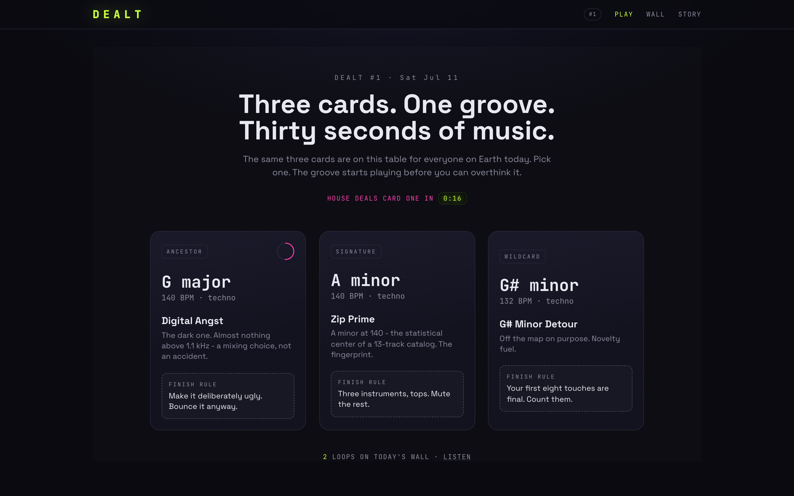

# DEALT - the daily loop

Three cards. One groove. Thirty seconds of music. Every day, the whole
internet gets the same deal.

Live at https://dealt-production-hczrri.laravel.cloud



## What this is

Dealt is an anti-blank-page machine for music. Open the page and three cards
are already on the table, generated from the DNA of a real 1999 techno catalog
(mine, recovered from a dying CD-R 26 years later). Each card carries a key, a
tempo, a seeded groove that is already playing, and one finish rule that
defines "done" before you start. Pick a card, or hesitate 30 seconds and the
house picks for you. Twist the pattern, bounce it to the wall, come back
tomorrow.

No AI anywhere in the product. The cards are dealt by a seeded PRNG, the
synths are wired by hand in Web Audio, and every loop on the wall is exactly
what a person tapped into a grid. You can download any loop you make as a
.mid file and finish it in a real DAW.

## How it works

- DealService deals the day from `mulberry32(Ymd)`: an ancestor card from
  the 13-track catalog DNA, the signature card (A minor at 140 BPM, the
  statistical center of the catalog), and a sidepath or wildcard. Three
  distinct finish rules, seeded 6x16 patterns, note tables per key. Same date,
  same deal, everywhere, forever. There is no deal storage; it is arithmetic.
- The engine (resources/js/audio.js) synthesizes six voices live: 909-ish
  kick, noise clap, hats, saw bass with a closing filter, detuned stab chords,
  and a delayed lead. Lookahead scheduling keeps the groove tight.
- The wall stores only patterns (kilobytes, not audio files) and
  re-synthesizes every loop client-side on play. New bounces arrive live over
  Laravel Reverb. A full listen counts as a spin.
- Streaks live in localStorage. There are no accounts and no signups.

## Run it yourself

```bash
git clone https://github.com/joshuaswarren/dealt && cd dealt
composer install && npm install
cp .env.example .env && php artisan key:generate
# point DB_* at Postgres, then:
php artisan migrate
npm run build
php artisan serve
```

Tests: `./vendor/bin/pest` (the deal determinism suite asserts the exact
card contract across dates).

Deploying your own: `cloud ship` from the repo root does the whole thing on
[Laravel Cloud](https://cloud.laravel.com) - app, Postgres, Reverb websocket
cluster - in about a minute. That is how this instance got here.

## The story

In 2000 a track of mine won amp3.com's first Pick Hit Gold of the millennium.
Then the files were lost for 25 years, and in all that time I never started
another project. The blank page won every day until this one. The full story
is on [the about page](https://dealt-production-hczrri.laravel.cloud/about),
and the recovered tracks are free in the
[Internet Archive](https://archive.org/details/iuma-dj_zip).

Stack: Laravel 13, Livewire 4, Reverb, Postgres, Web Audio, Tailwind 4.
Built in one Saturday for Taylor Otwell's Laravel Cloud weekend challenge.

-josh
